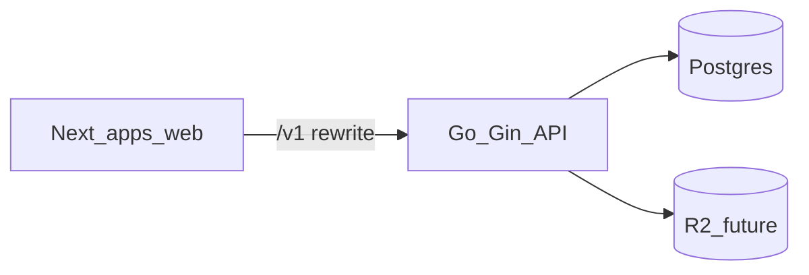

# UTSAV architecture (v0)

## Components

- **Web (`apps/web`)**: Next.js App Router, Tailwind, marketing + host UX (consolidated landing with API ping in bootstrap disk constraints). Rewrites `/v1/*` to the API base URL.
- **API (`services/api`)**: Go + Gin, stateless JWT access tokens + rotating refresh tokens (hashed at rest), per-event RBAC checks against `events.owner_user_id` and `event_members`.
- **Database**: PostgreSQL via versioned SQL migrations (`db/migrations`).
- **Object storage (future)**: R2/MinIO behind an interface; gallery rows store `object_key`.

## Request flow

## Auth

- Host/organiser: phone OTP issues **access JWT** (HS256, `JWT_SECRET`) and **refresh token** (random 32 bytes, SHA-256 stored).
- Guest (RSVP/shagun): separate **guest JWT** (`iss=utsav-guest`, `sub=<eventUUID>|<phone>`).

## Compliance note (shagun)

UPI is **peer-to-peer**; API stores **metadata only** (amount self-report, blessing text, deep-link parameters).
